[⬅ Back to Home](README.md)
# <span id="garage"></span>Garage

Models and textures designed by Tim Kang ([slug_7](https://www.instagram.com/slug_7/))

## S-Class
- [Blue Miata (Arios Kit)](#blue-miata-arios-kit)
- [Miata VIP](#miata-vip)
- [Ueo AE86](#ueo-ae86)
- [System Miata (Arios Kit)](#system-miata-arios-kit)
- [Hibino Levin AE86](#hibino-levin-ae86)
- [Solara](#solara)
- [Solara32](#solara32)

## A-Class
- [Track Miata](#track-miata)
- [Green Ueo AE86](#green-ueo-ae86)
- [Purple Track Miata](#purple-track-miata)
- [Yellow Miata (Arios Kit)](#yellow-miata-arios-kit)
- [Takumi AE86](#takumi-ae86)

## B-Class
- [Red Miata (Lip Kit)](#red-miata-lip-kit)
- [Yellow Miata (Lip Kit)](#yellow-miata-lip-kit)
- [AE86](#ae86)
- [Levin AE86](#levin-ae86)

<div style="margin-top:80px;"></div>

# ⛏️ How to Summon

You can summon any of the cars in-game by renaming a boat (or using commands).  
Here’s a **general template** you can use:

```mc
/summon boat ~ ~ ~ {Type:"<wood_type>",CustomName:"\"<ModelName>\""}
```

- Replace `<wood_type>` with one of: `acacia`, `birch`, `spruce`  
- Replace `<ModelName>` with the exact name tied to the texture (e.g. `TakumiAE86`, `BlueMiataAriosKit`, `MiataVip`)  

Example:
```mc
/summon boat ~ ~ ~ {Type:"spruce",CustomName:"\"TakumiAE86\""}
```

This will summon **Takumi’s AE86** using a spruce boat.

<div style="margin-top:80px;"></div>

<span style="font-size:30px">Spruce</span>

<div style="display: flex; justify-content: space-between; align-items: center;">
  <h2 id="blue-miata-arios-kit">Blue Miata (Arios Kit)</h2>
  <a href="#garage">⬆ Back to top</a>
</div>

```mc
/summon boat ~ ~ ~ {Type:"spruce",CustomName:"\"BlueMiataAriosKit\""}
```

<p align="center">
  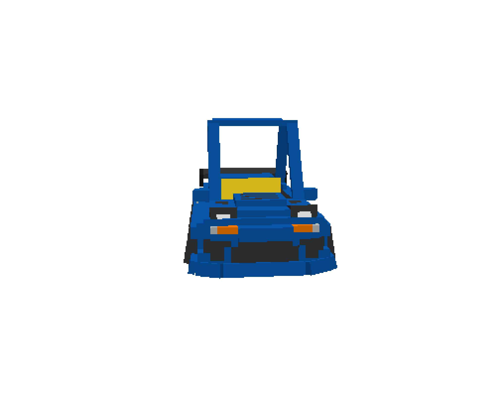
</p>

<div style="display: flex; justify-content: space-between; align-items: center;">
  <h2 id="miata-vip">Miata VIP</h2>
  <a href="#garage">⬆ Back to top</a>
</div>

```mc
/summon boat ~ ~ ~ {Type:"spruce",CustomName:"\"MiataVip\""}
```

<p align="center">
  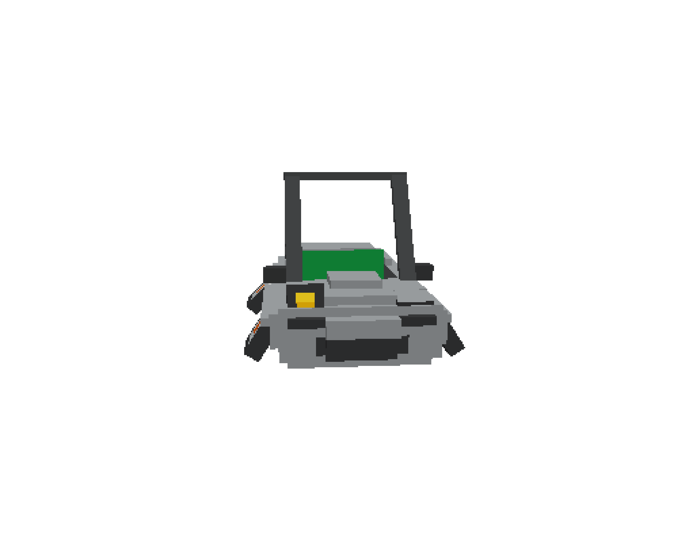
</p>

<div style="display: flex; justify-content: space-between; align-items: center;">
  <h2 id="ueo-ae86">Ueo AE86</h2>
  <a href="#garage">⬆ Back to top</a>
</div>

```mc
/summon boat ~ ~ ~ {Type:"spruce",CustomName:"\"UeoAE86\""}
```

<p align="center">
  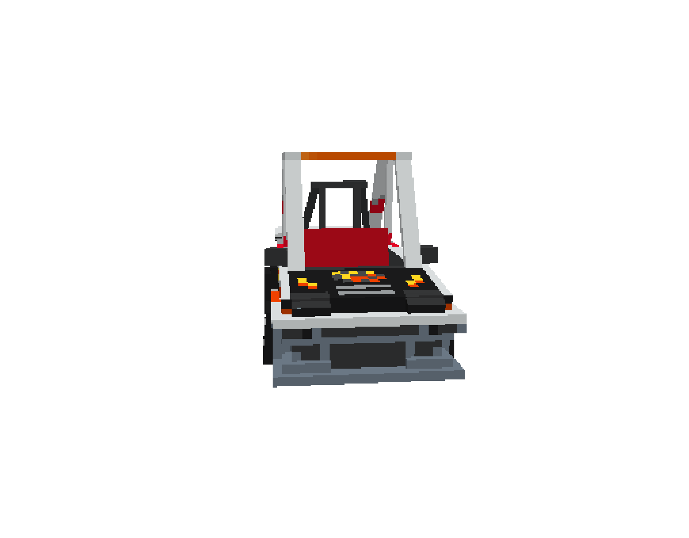
</p>

<div style="display: flex; justify-content: space-between; align-items: center;">
  <h2 id="system-miata-arios-kit">System Miata (Arios Kit)</h2>
  <a href="#garage">⬆ Back to top</a>
</div>

```mc
/summon boat ~ ~ ~ {Type:"spruce",CustomName:"\"SystemMiataAriosKit\""}
```

<p align="center">
  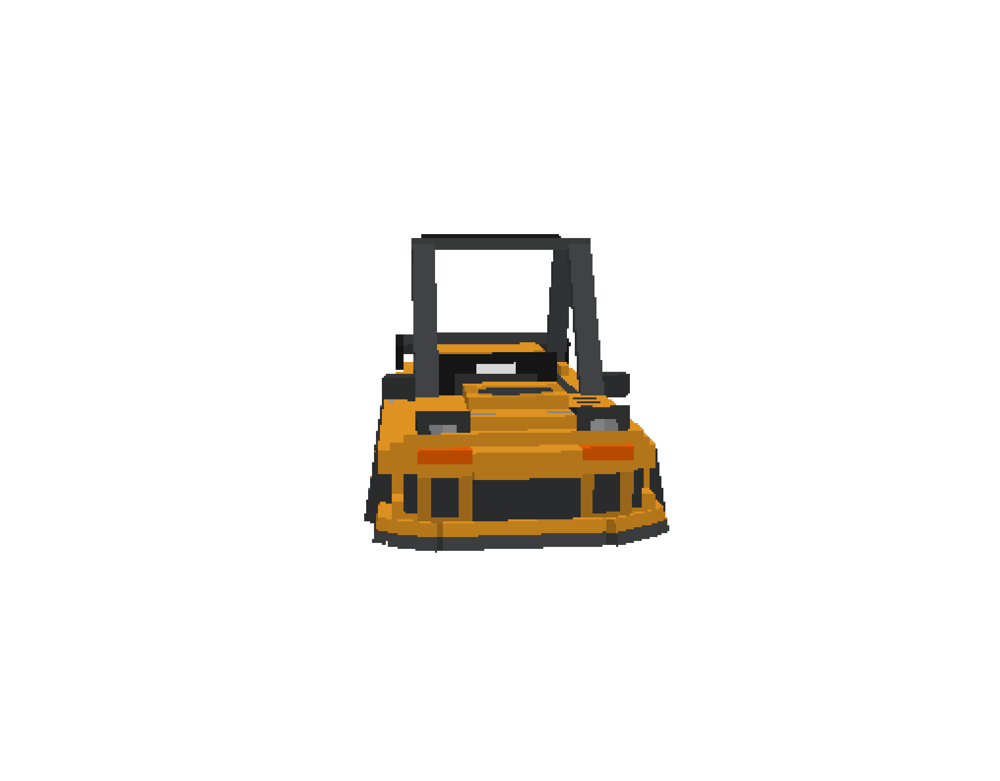
</p>

<div style="display: flex; justify-content: space-between; align-items: center;">
  <h2 id="hibino-levin-ae86">Hibino Levin AE86</h2>
  <a href="#garage">⬆ Back to top</a>
</div>

```mc
/summon boat ~ ~ ~ {Type:"spruce",CustomName:"\"HibinoLevinAE86\""}
```

<p align="center">
  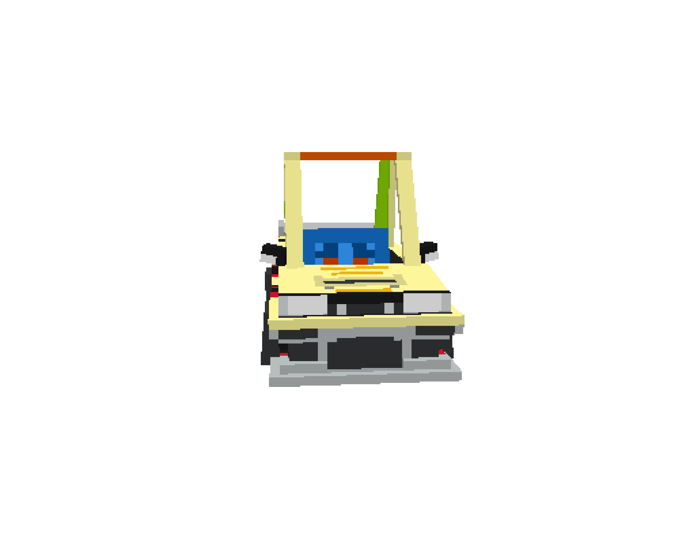
</p>

<div style="display: flex; justify-content: space-between; align-items: center;">
  <h2 id="solara">Solara</h2>
  <a href="#garage">⬆ Back to top</a>
</div>

```mc
/summon boat ~ ~ ~ {Type:"spruce",CustomName:"\"Solara\""}
```

<p align="center">
  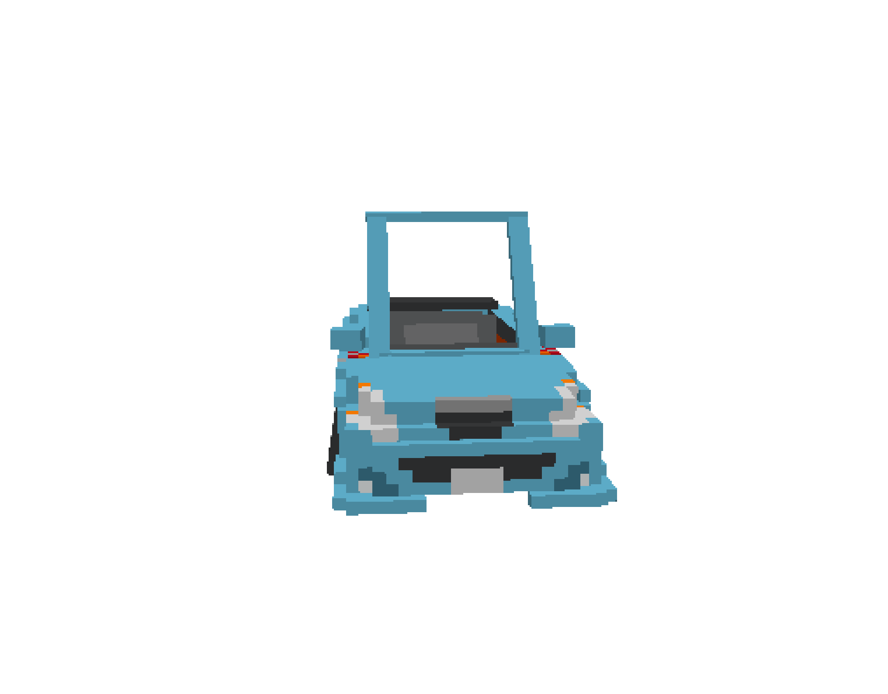
</p>

<div style="display: flex; justify-content: space-between; align-items: center;">
  <h2 id="solara32">Solara32</h2>
  <a href="#garage">⬆ Back to top</a>
</div>

```mc
/summon boat ~ ~ ~ {Type:"spruce",CustomName:"\"Solara32\""}
```

<p align="center">
  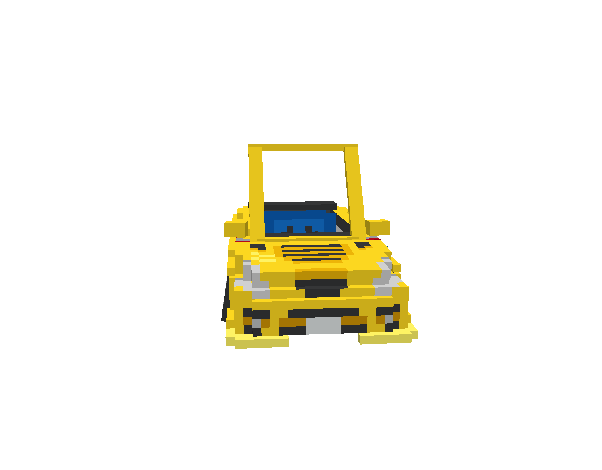
</p>


<span style="font-size:30px">Acacia</span>

<div style="display: flex; justify-content: space-between; align-items: center;">
  <h2 id="track-miata">Track Miata</h2>
  <a href="#garage">⬆ Back to top</a>
</div>

```mc
/summon boat ~ ~ ~ {Type:"acacia",CustomName:"\"TrackMiata\""}
```

<p align="center">
  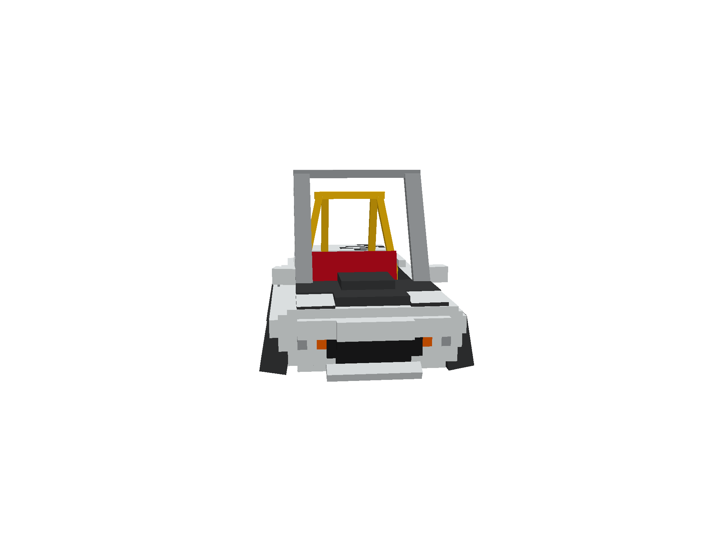
</p>

<div style="display: flex; justify-content: space-between; align-items: center;">
  <h2 id="green-ueo-ae86">Green Ueo AE86</h2>
  <a href="#garage">⬆ Back to top</a>
</div>

```mc
/summon boat ~ ~ ~ {Type:"acacia",CustomName:"\"GreenUeoAE86\""}
```

<p align="center">
  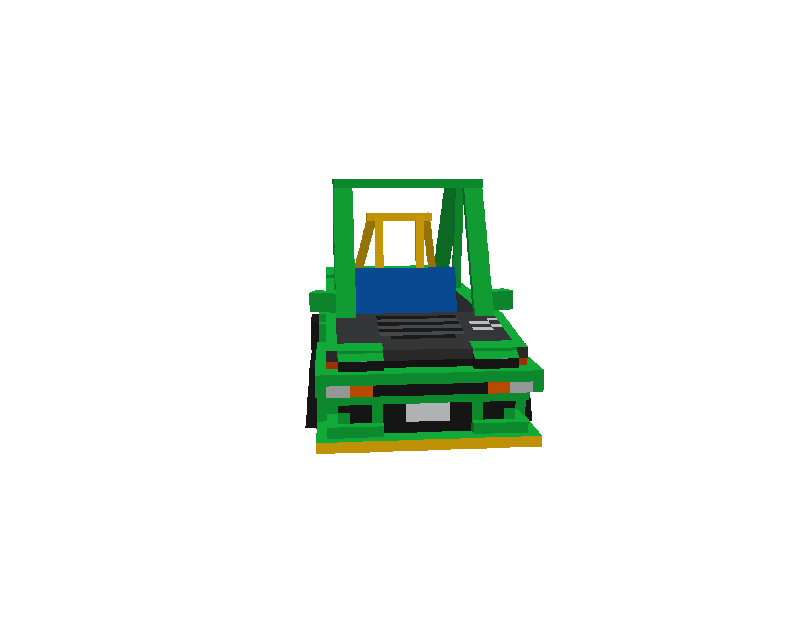
</p>

<div style="display: flex; justify-content: space-between; align-items: center;">
  <h2 id="purple-track-miata">Purple Track Miata</h2>
  <a href="#garage">⬆ Back to top</a>
</div>

```mc
/summon boat ~ ~ ~ {Type:"acacia",CustomName:"\"PurpleTrackMiata\""}
```

<p align="center">
  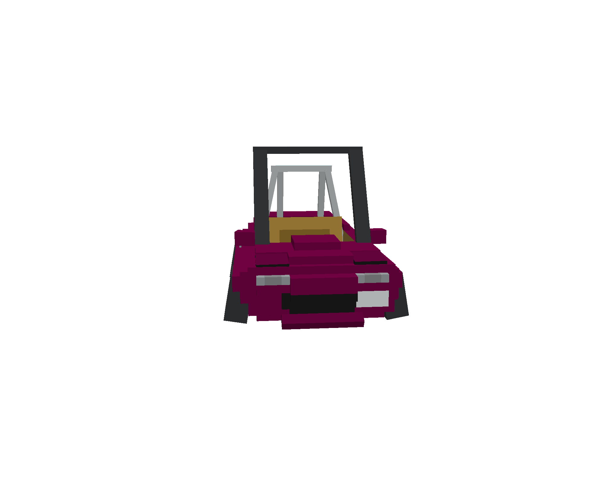
</p>

<div style="display: flex; justify-content: space-between; align-items: center;">
  <h2 id="yellow-miata-arios-kit">Yellow Miata (Arios Kit)</h2>
  <a href="#garage">⬆ Back to top</a>
</div>

```mc
/summon boat ~ ~ ~ {Type:"acacia",CustomName:"\"YellowMiataAriosKit\""}
```

<p align="center">
  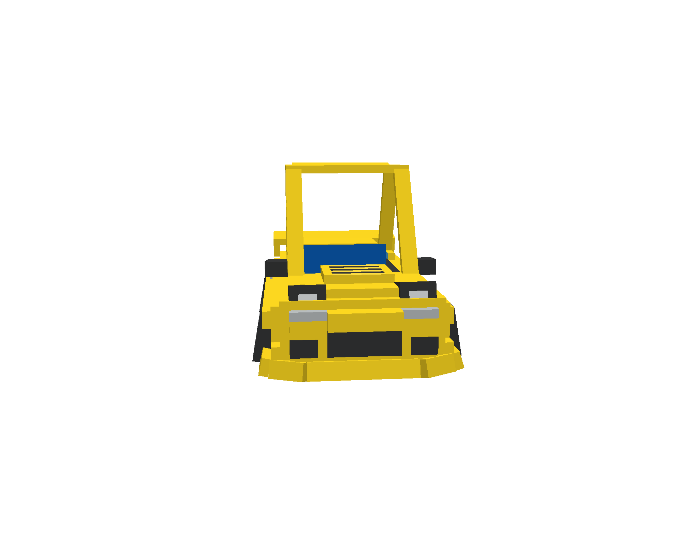
</p>

<div style="display: flex; justify-content: space-between; align-items: center;">
  <h2 id="takumi-ae86">Takumi AE86</h2>
  <a href="#garage">⬆ Back to top</a>
</div>

```mc
/summon boat ~ ~ ~ {Type:"acacia",CustomName:"\"TakumiAE86\""}
```

<p align="center">
  
</p>


<span style="font-size:30px">Birch</span>

<div style="display: flex; justify-content: space-between; align-items: center;">
  <h2 id="red-miata-lip-kit">Red Miata (Lip Kit)</h2>
  <a href="#garage">⬆ Back to top</a>
</div>

```mc
/summon boat ~ ~ ~ {Type:"birch",CustomName:"\"RedMiataLipKit\""}
```

<p align="center">
  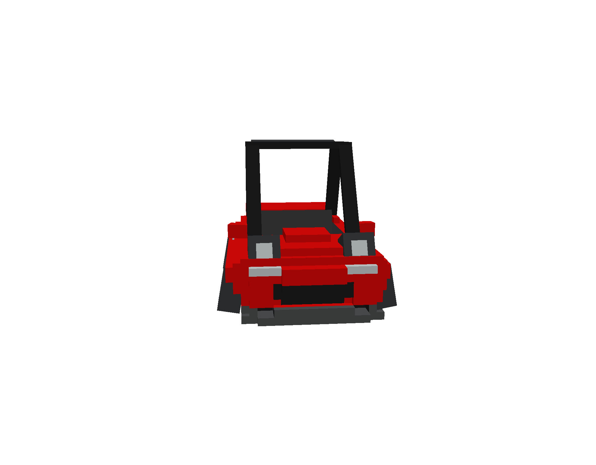
</p>

<div style="display: flex; justify-content: space-between; align-items: center;">
  <h2 id="yellow-miata-lip-kit">Yellow Miata (Lip Kit)</h2>
  <a href="#garage">⬆ Back to top</a>
</div>

```mc
/summon boat ~ ~ ~ {Type:"birch",CustomName:"\"YellowMiataLipKit\""}
```

<p align="center">
  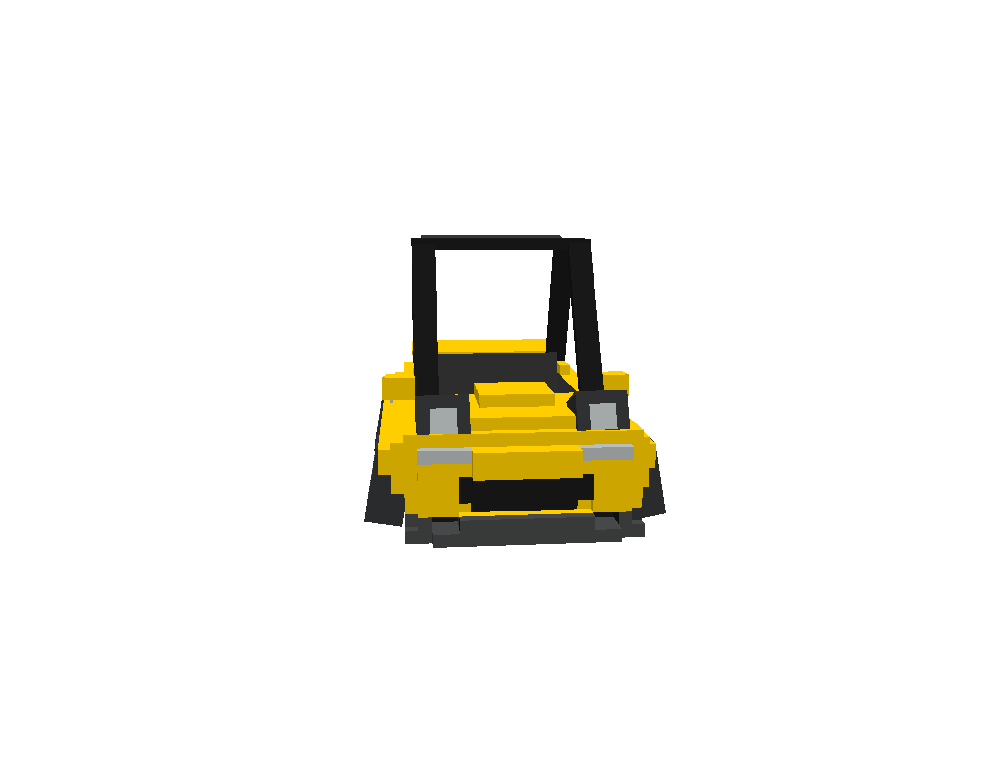
</p>

<div style="display: flex; justify-content: space-between; align-items: center;">
  <h2 id="ae86">AE86</h2>
  <a href="#garage">⬆ Back to top</a>
</div>

```mc
/summon boat ~ ~ ~ {Type:"birch",CustomName:"\"AE86\""}
```

<p align="center">
  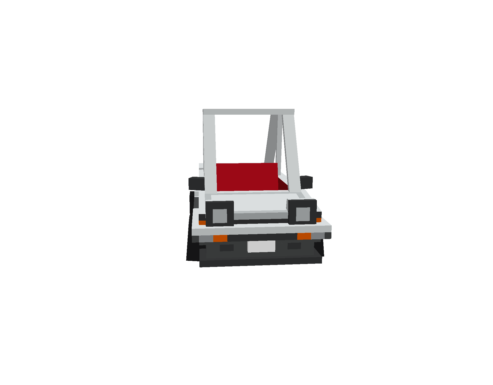
</p>

<div style="display: flex; justify-content: space-between; align-items: center;">
  <h2 id="levin-ae86">Levin AE86</h2>
  <a href="#garage">⬆ Back to top</a>
</div>

```mc
/summon boat ~ ~ ~ {Type:"birch",CustomName:"\"LevinAE86\""}
```

<p align="center">
  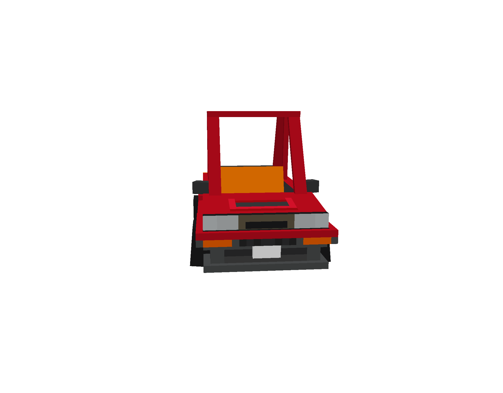
</p>

<p align="center">
  <a href="#garage" style="font-size:28px; font-weight:bold; text-decoration:none;">
    ⬆ Back to Top ⬆
  </a>
</p>
