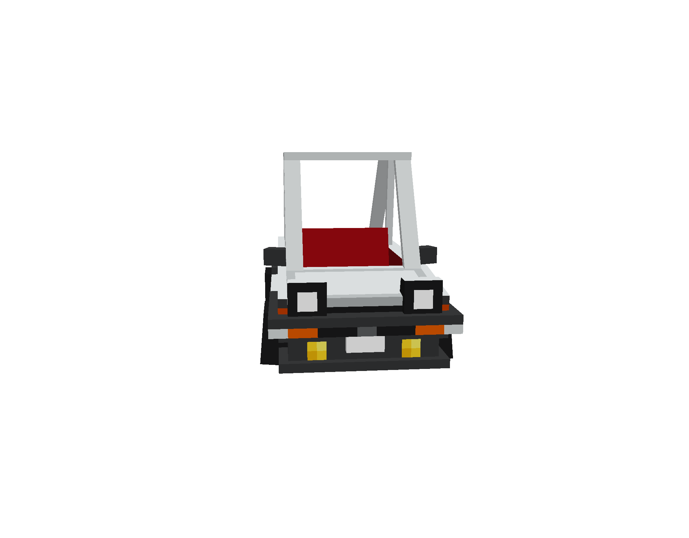
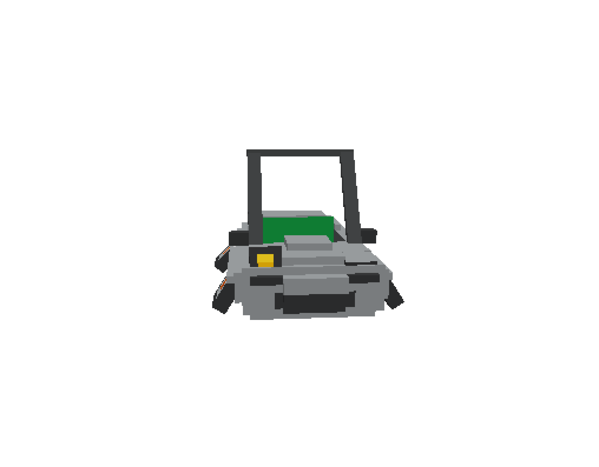
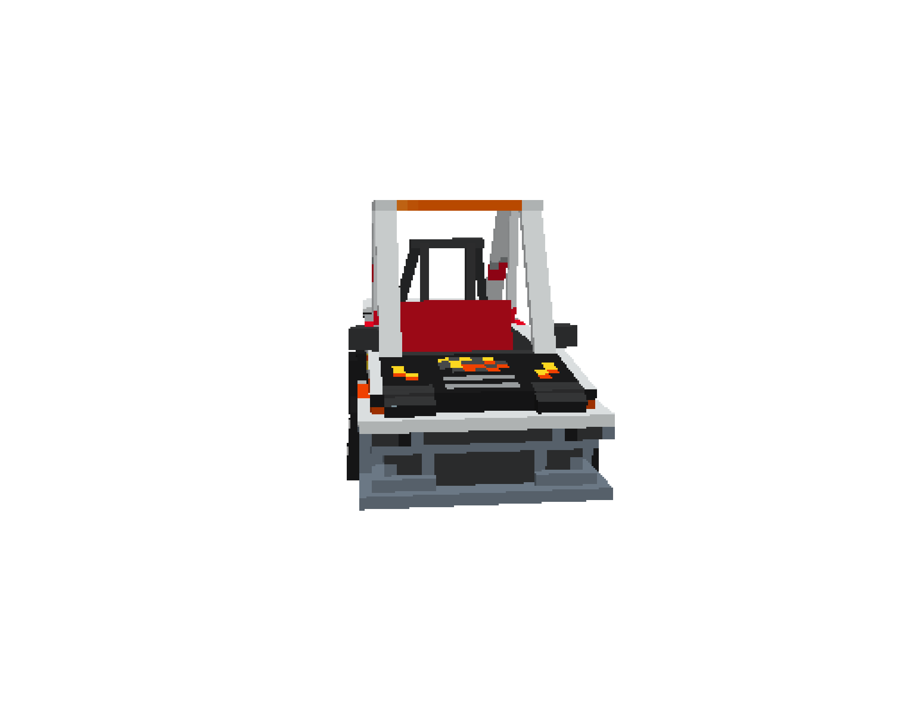
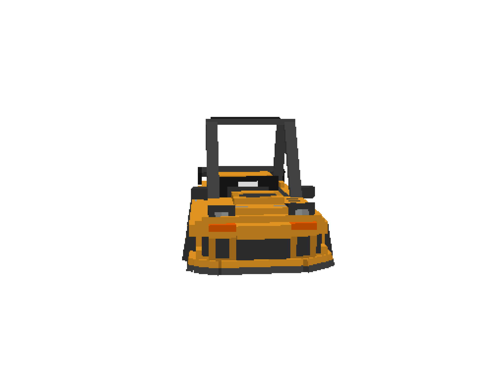
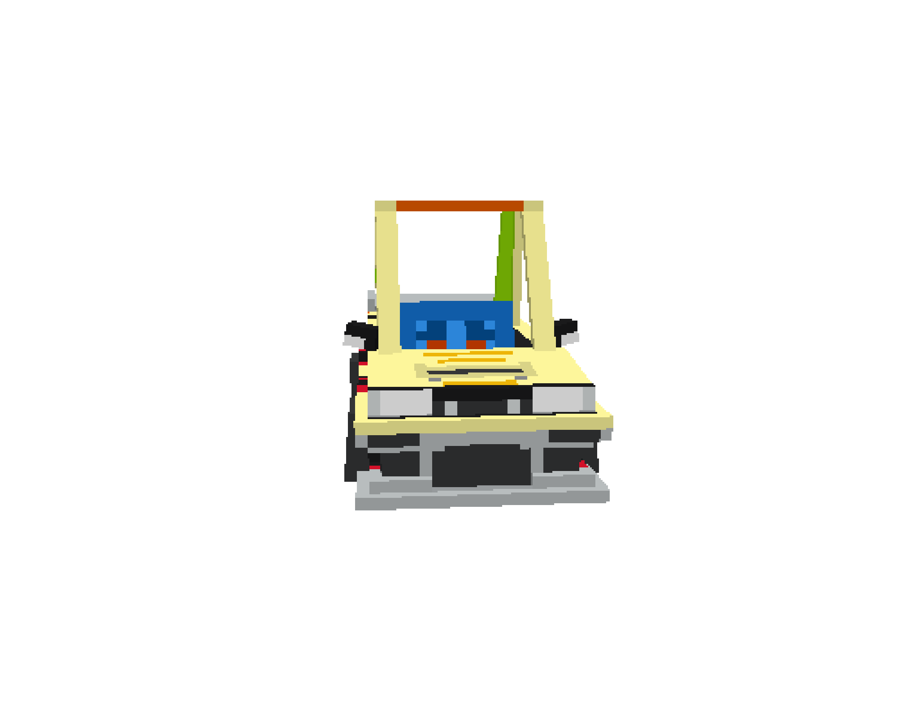

  

<h2 align="center"><b>A Minecraft CEM Texture Pack</b></h2>

  

  ➡➡➡ <a href=".assets/GARAGE.md">Enter Garage</a> ⬅⬅⬅

## 🏎️ About

**Garage32** is a custom **Minecraft CEM texture pack** that transforms simple boats into fully modeled cars.   

-   Fully supports Custom Entity Models (CEM).
-   Includes multiple car models and style variations.
-   Organized by wood types (acacia, birch, spruce) for easy selection.

Models and textures were designed by **Tim Kang** ([slug_7](https://www.instagram.com/slug_7/))

## 📸 Screenshots

|  |  |  |
|---------------------------------------------------------|---------------------------------------------------------|-------------------------------------------------------|

## 🚘 Preview

|  |  |  |  |  |
|:----------------------------------------------------------:|:-------------------------------------------------:|:-------------------------------------------------:|:------------------------------------------------------------:|:----------------------------------------------------------:|
| 
Blue Miata (Arios Kit)
            | 
Miata VIP
                   | 
Ueo AE86
                   | 
System Miata (Arios Kit)
            | 
Hibino Levin AE86
                   |

## 🔧 Installation

1.  Download the Garage32 texture pack .zip file.

2.  Place it into your Minecraft resourcepacks folder:

        .minecraft/resourcepacks

3.  Launch Minecraft and enable Garage32 from the Resource Packs menu.

4.  Use the correct entity spawns or commands to cycle through the
    different car textures.

## 📝 Notes

-   This pack requires OptiFine (or another CEM-compatible mod/loader)
    for custom entity models to function correctly.  
-   Feel free to fork and optimize this system of making models.  
-   A second version of this texture pack is currently in development, though it is being kept private for the time being.

## 👥 Credits

This project was made possible with the help of:

  

Entertainment collective & creative input</a>

  
  

- [Tim Kang](https://www.instagram.com/slug_7/)
- [Tuvshin Dashteren](https://www.linkedin.com/in/tuvshindash/)
- [Justin Reid](https://www.linkedin.com/in/justin-mreid/)
- Thomas Zhou
- Ian Almeda
- [Jorge Manuel Torre](https://github.com/slumpy666)

## 📬 Contact
- [LinkedIn](https://www.linkedin.com/in/jmt1006/)
- [GitHub](https://github.com/slumpy666)

## 📜 License
This project is licensed under the [GNU General Public License v3.0](LICENSE).